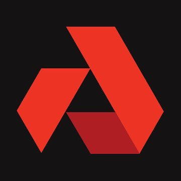
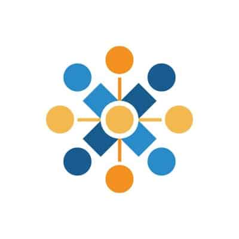

 
  

  

# Mainnet Validator

Don't forget to delegate to Bitoven validator on below mainnet network:

| 
Network   
      | 
Validator Address 
 |
|:-------------|:------|
| 
Oasis   
| `oasis1qrs8zlh0mj37ug0jzlcykz808ylw93xwkvknm7yc` |
| 
Akash   
| `akashvaloper153a3745hrcswmsdx7wwaqqva7lkreu5pa5ccfx` |
| 
Avalanche   
| `NodeID-GHsDHYeRXaK1UZizpCWvoN26kb6B1s1PE` |

* * *

## Network I've Joined

| 
Network   
      | 
Some Notes 
 |
|:-------------|:------|
| 
Joystream   
| This is the network I've joined the longest time. Since it was a torrent project and now it is a video platform. Created telegram bot for its main telegram channel (bad code since I am not a coder, but it worked 😂) |
| 
Snax   
| Maybe this is the first network with dPOS I've joined. But I no longer being a validator there. EOS alike |
| 
Oasis   
| Privacy focused blockchain, very technical environment. **I got 6th validator rank on questnet** 😀 |
| 
Bluzelle   
| Joined Bluzelle Swarm of Duty and got **0 missed blocks on Voting Participation and Power Uptime during testnet** |
| 
Harmony   
| Pangaea! |
| 
Pocket   
| Relay service, tendermint |
| 
Plasm   
| Polkadot |
| 
Regen   
| Many challanges during the testnet, got much experience from it :yum:, tendermint |
| 
Matic   
| Mini challanges with rewards during the testnet. |

* * *

# About

I am a cryptocurrency hobbyist. I actually acknowledged Bitcoin/crypto since 2011 and have some of it stored on exchange. Then I forgot it like most of people done, because BTC was so cheap back then. Until BTC massive pump happened on 2017, I remembered, "Ah, I have some coins on exchange xxx". I went to check it out, but BAM!, the exchange has disappeared. 

That was stupid of me back then that I left my assets on exchange. I didn't understand that I could save my crypto assets (private key) on paper or offline storage, I thought it must be online 24/7 !!!

But, I would still love crypto. There were many projects popped out on 2017. Although most of them were shitcoins, ponzi schemes or blatantly scams. My interest was on mining new coins. Most of them were POW coins. New forked coins appeared everyday. But yeah, mostly are dead projects now. We can see now that consensus protocol interest are shifting to POS. So I try to get experience of it by participating on many projects by being validator.

Why do I choose to participate in this crypto space?

First, I believe with spirit of decentralization, mass adoption will come true, one of the way to go there is by making "normal people" like me to participate in. I make assumption that if I can open and back up wallet, mining coin, being validator, delegating, etc, other "normal people" also can do it.

Second, I find inspiration in independent validators like [meleatrust](https://meleatrust.com/) also [moonli.me](https://moonli.me/) and believe that ***"smaller validators should have more power and wider participation in POS systems" (moonli.me).*** :wink: 

Third, profit, knowledge and experience gain, no need to explain :grin:

* * *

## Extras

_Forgive me for my imperfect writing, I am not a native English speaker. As long as we can understand each other, the purpose of communication is fulfilled, isn't it?_  
Any input is appreciated. Contact me via **_bitoven[at]protonmail.com_**
